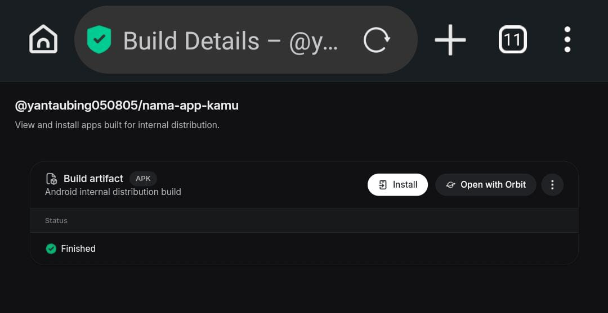
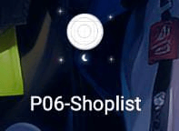
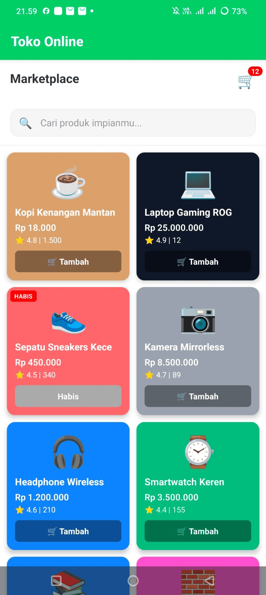

# 📱 [Nama Aplikasi Kamu] 

**Oleh:** Freddy (NIM: 243303621223)

> Aplikasi [Jenis Aplikasi, cth: Marketplace / Profile Card] yang dibangun menggunakan React Native dan di-build menjadi APK melalui Expo Application Services (EAS).

## ✨ Fitur Utama
- 🛒 **[Fitur 1]:** [Contoh: Menampilkan daftar produk menggunakan FlatList yang responsif]
- 🔐 **[Fitur 2]:** [Contoh: Autentikasi dan fitur Stay Logged In dengan AsyncStorage]
- 📍 **[Fitur 3]:** [Contoh: Integrasi Kamera / GPS / Data dari REST API]
- ℹ️ **App Version Display:** Menampilkan versi aplikasi (v1.0.0) di dalam UI aplikasi.

## 📥 Download APK
Kamu bisa mengunduh dan mencoba langsung aplikasi ini di HP Android secara native melalui link EAS di bawah ini:

> **Catatan:** Link APK EAS berlaku selama 30 hari. 

### 🛠️ Cara Install di HP Android
1. Buka link download di atas menggunakan browser di HP Android kamu.
2. Unduh file `[nama-file].apk`.
3. Buka file APK tersebut. Jika muncul peringatan keamanan, izinkan instalasi dari **Sumber Tidak Dikenal (Unknown Sources)**.
4. Selesaikan instalasi dan buka aplikasi.

---

## 📸 Screenshot Antarmuka (UI) Aplikasi

  <!-- Ganti link src dengan nama file screenshot aslimu di folder screenshots/ -->
  
  
  

---

## 🚀 Bukti Proses Build & Install (Portofolio)

Berikut adalah dokumentasi bukti bahwa aplikasi berhasil di-build dengan EAS CLI dan dijalankan secara native di perangkat Android fisik (tanpa Expo Go):

### 1. Status EAS Build di Dashboard (FINISHED)

*Status build Android dengan profile preview berhasil (Finished).*

### 2. Dialog Instalasi APK di Perangkat Fisik

### 3. Icon Aplikasi di App Drawer (Home Screen)

*Aplikasi menggunakan custom icon resolusi 1024x1024.*

### 4. Aplikasi Berjalan Native (Tanpa Frame Expo Go)

*Custom splash screen dan antarmuka berjalan lancar tanpa crash.*

---

## 🌐 Coba Secara Online (Expo Snack)
Untuk melihat secara langsung kode atau mencoba versi interaktifnya tanpa mengunduh APK, silakan kunjungi Expo Snack berikut:
👉 **[Klik di sini untuk membuka Expo Snack](https://expo.dev/accounts/yantaubing050805/projects/nama-app-kamu/builds/f6b30606-8d90-4617-b900-1288ef064c09)**

## 💻 Tech Stack
- **Framework:** React Native / Expo
- **Build System:** Expo Application Services (EAS CLI)
- **Komponen Utama:** FlatList, ScrollView, StyleSheet
- **State/Storage:** [Misal: React Navigation, AsyncStorage, Firebase]"# pertemuan-14" 
"# pertemuan-14" 
"# pertemuan-14" 
"# pertemuan-14" 
"# pertemuan-14" 
"# pertemuan-14" 
"# pertemuan-14" 
# pertemuan-14
# pertemuan-14
# pertemuan-14
# pertemuan-14
"# p14-programing" 
