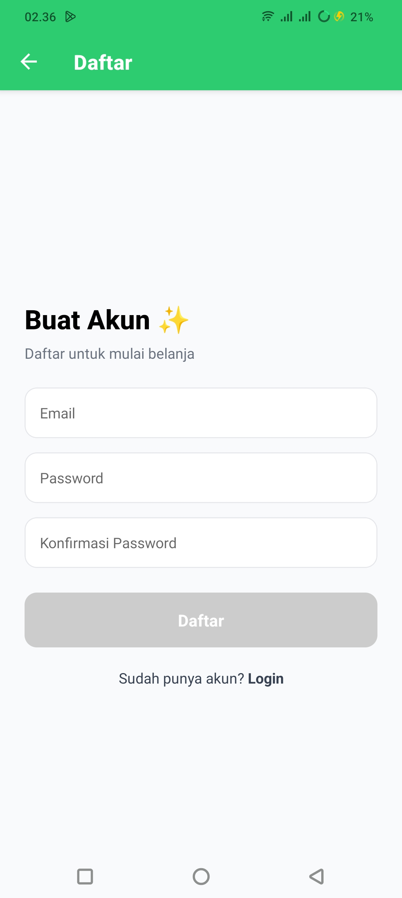
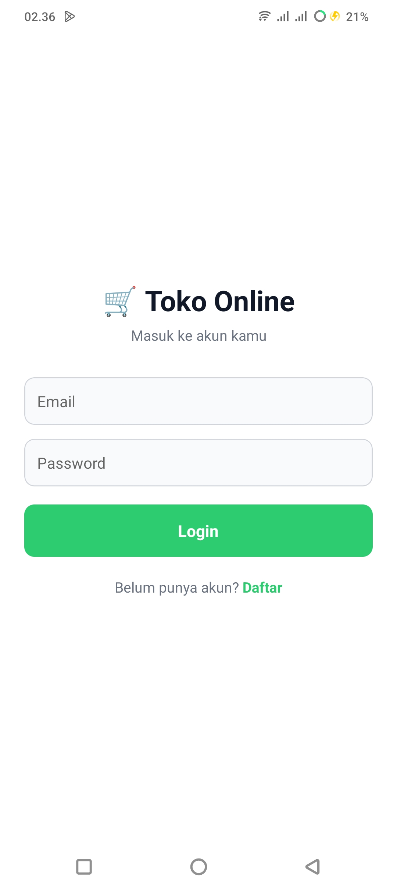
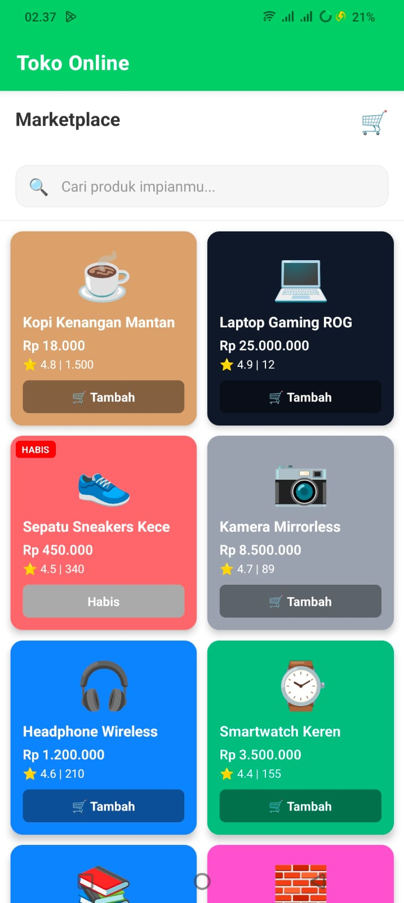
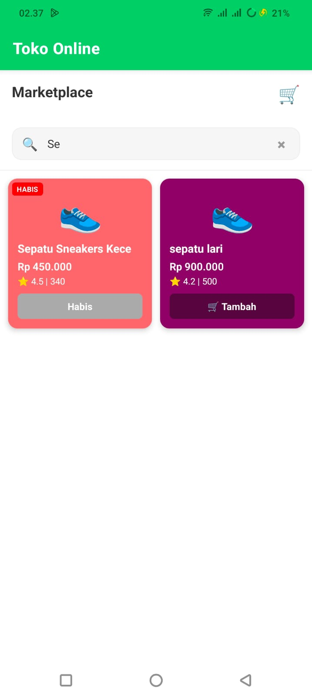
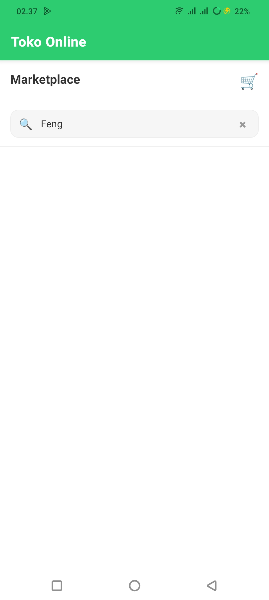
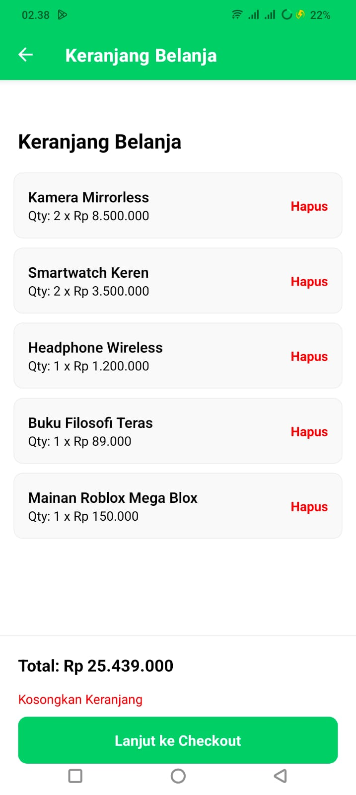
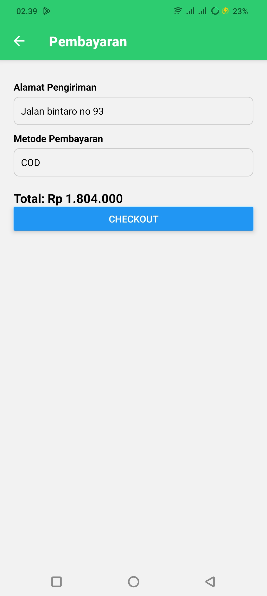
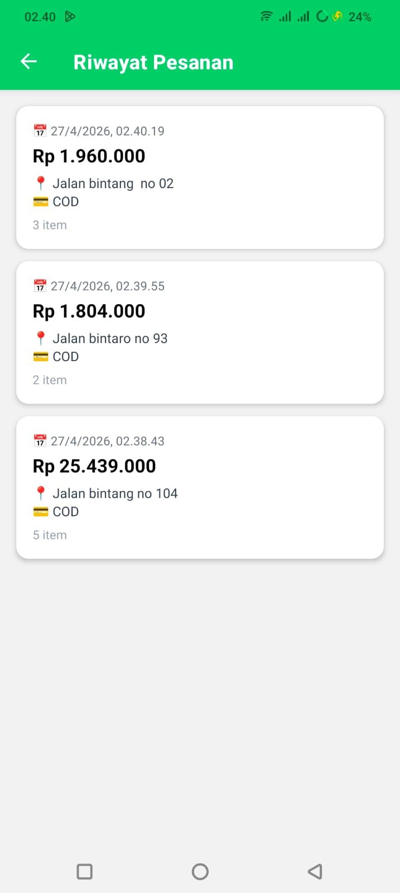

# ShopList App - Pemrograman Mobile Pertemuan 6

## Nama & NIM
- Nama: [ FREDDY ]
- NIM:  [ 243303621223 ]

## Fitur yang Diimplementasikan
- [x] FlatList dengan 12+ produk
- [x] Custom ProductCard component (file terpisah)
- [x] keyExtractor dengan ID unik
- [x] ListEmptyComponent (empty state)
- [x] Search / Filter real-time
- [x] Pull-to-Refresh
- [ ] Filter Kategori (E1) — isi jika dikerjakan
- [ ] Toggle List/Grid View (E2) — isi jika dikerjakan
- [ ] SectionList Mode (E3) — isi jika dikerjakan
- [ ] Sort Produk (E4) — isi jika dikerjakan

## Screenshot
### Tampilan Utama (Daftar belanja toko online)

### Tampilan Utama (Login belanja toko online)

### Tampilan Utama (List Produk)

### Tampilan Search — saat ada hasil

### Tampilan Empty State — saat tidak ada hasil

### Tampilan Empty State — saat keranjang belanja

### Tampilan Empty State — saat pembayaran/checkout

### Tampilan Empty State — saat Riwayat Pesanan

## Cara Menjalankan
1. Clone repo  : git clone []
2. Install deps: npm install
3. Jalankan    : npx expo start
4. Scan QR Code dengan Expo Go di HP"# pemmobile-p06--FREDDY-" 
"# pemmobile-p06--FREDDY-" 
